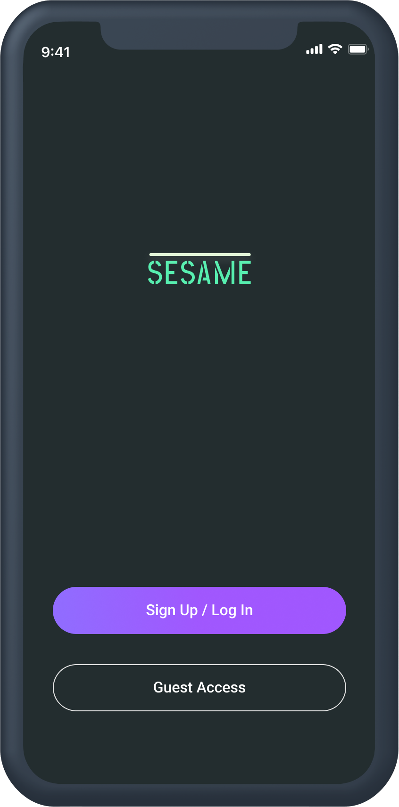
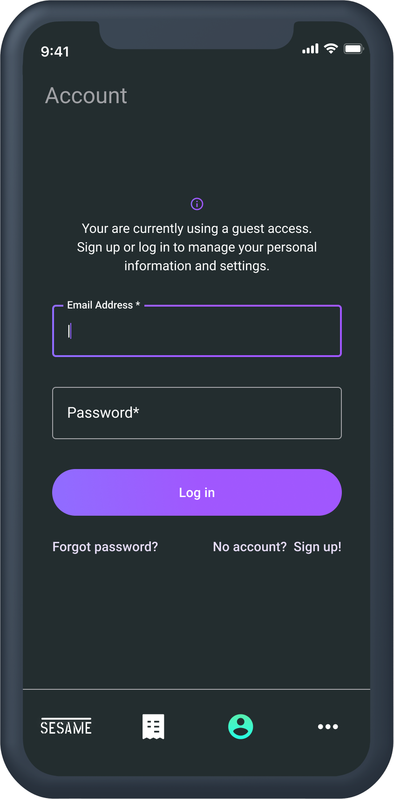
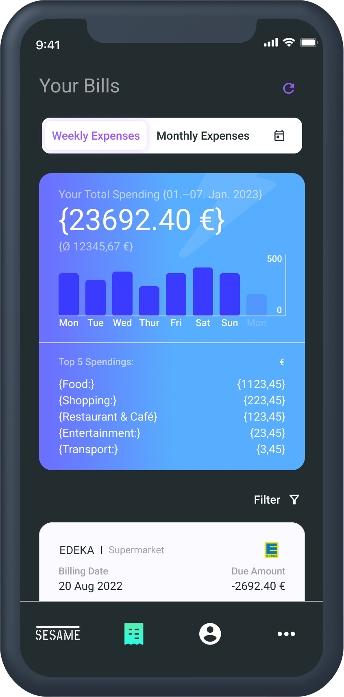
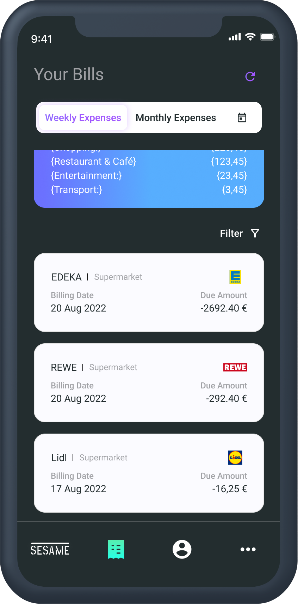
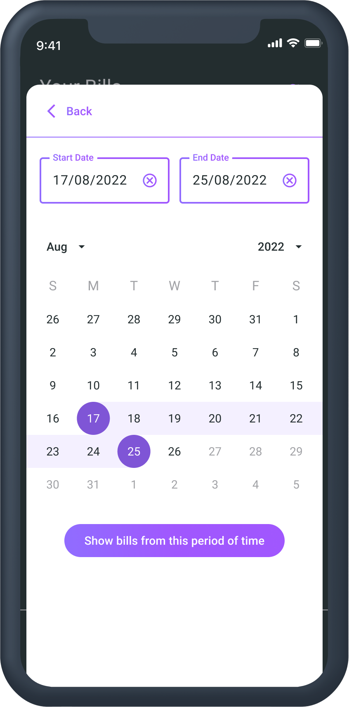

_Receipts cause clutter, but contain useful data that is easily lost._  
What can I do about this if I want to record the information on my receipts in a structured way in order to get an overview of my expenses, to be able to call them up without much effort and to better understand my spending behavior?
**you can use SESAME.**

## Introduction

SESAME should help you to bundle your expenses in a structured way in one app. With your own account you can keep track of your receipts. You can assign each of your receipts to a category of your choice, such as "Shopping", "Groceries", "Travelling", "Rent" etc., with the value, date and place of issue. You can enter your receipts manually, or you can import a photo of your receipt from which Optical Character Recognition can recognize the relevant information (output value, date, output location and, if applicable, category). The user gets his expenses summarized in a weekly or monthly view. For the selected period, the categories with the largest output values are listed below the view. This way you can keep track of your expenses in the long run and no longer have to keep piles of paper or worry about not being able to find a receipt.

## Data Science

In our project, we utilized a dataset created internally by Cristina, which included detailed information about her personal expenses such as the date, category, and other relevant details. By analyzing this dataset, we were able to identify the most useful features for a user tracking their expenses. To clean, process, and visualize the data, we used a combination of Jupyter Notebooks, Visual Studio Code, and Python. This allowed us to efficiently manipulate and analyze the data, as well as organize our code and present our findings to the rest of the team. Additionally, we used various visualization tools to gain further insights into the data and explain how the features should look to the front-end of our product. As the backend team required, we converted the relevant dataframes into CSV or JSON format. Below, we have included some screenshots with explanations of our data cleaning and visualization process.

### raw data

In Screenshot 1, you can see our raw data. To begin with, we converted the date column into datetime format. Then, we removed any errors or missing values, checked for duplicates, and rectified any errors that were spotted. This allowed us to ensure that our data was accurate and complete, which was essential for our analysis and visualization.

  

### processed data
After having a look at the raw data, we had a DS group meeting and decided on some hypotheses and settled on some interesting experiments that we could run to learn more about the bigger picture of the data. We categorized the data by grouping it based on the date column by week, month, or day of the week. This allowed us to explore the data further and identify new patterns and trends, and set the foundation to further understand the patterns and trends through visualisation in the next step.

   

the final dataframe looks as follows ..  
  

### insights
In the Insights section, you can see that we explored many different types of charts. Our favorites were the stacked bar chart and the donut pie chart.

In the stacked bar chart, we were able to show a lot of information in a way that doesn’t feel overwhelming. We felt that this would be highly useful to the user, as they could better understand the contribution of each category to their spending habits, while comparing over time, the changes in spending overall. For example, you can see in the bar chart that over time, the user was spending less money on average, possibly thanks to the increased awareness of their spending habits. 

  

The donut pie chart, on the other hand, allowed us to easily see the distribution of spending across different categories. We found this particularly useful when we were analyzing the data by month or week, as we could quickly see which categories were consuming a larger percentage of the user’s expenses.

  

  

It is also interesting to look at the categories individually. A line chart is sufficient here. Superimposing all the lines does not give a clear picture, as the scales of the categories differ greatly from one another.

barchart of the entire dataset

how does it look for Jul/Aug ..

or Aug/Sep ..

Therefore, the line diagrams are shown as a subplot. Here, the user quickly gets an overview of the dynamics of his categories, are these fixed costs that always demand a similar or identical amount or is it a cost unit that is subject to strong dynamics? 

An equally interesting consideration is breaking down the time into weekdays and weekends. The fixed costs already identified can theoretically be neglected here. Here it is noticeable that the majority of the costs arise within the week.

### OCR

In addition to dealing with the cristina dataset, a first analysis of receipts was carried out using optical character recognition. For this purpose, the python library pytesseract was used, which enables the specification of 14 psm (Page segmentation modes) and 4 oem (OCR Engine modes) for identifying and converting characters from an image to a string dataset. 

In ***psm*** 14 modes are provided:

- Orientation and script detection (OSD) only.
- Automatic page segmentation with OSD.
- Automatic page segmentation, but no OSD, or OCR. (not implemented)
- Fully automatic page segmentation, but no OSD. (Default)
- Assume a single column of text of variable sizes.
- Assume a single uniform block of vertically aligned text.
- Assume a single uniform block of text.
- Treat the image as a single text line.
- Treat the image as a single word.
- Treat the image as a single word in a circle.
- Treat the image as a single character.
- Sparse text. Find as much text as possible in no particular order.
- Sparse text with OSD.
- Raw line. Treat the image as a single text line, bypassing hacks that are Tesseract-specific.

In ***oem*** 4 modes are provided:

- Legacy engine only.
- Neural nets LSTM engine only.
- Legacy + LSTM engines.
- Default, based on what is available.

The pytesseract setting were is adjusted to the best fit (***psm*** ), respectively kept at mode 3 (***oem*** default, based on what is available). 

A set of 5 images were used to try the OCR in general, for instance the following one:

  

In the first step, the image quality was increased to enable better conversion of the information. the parameters brightness, contrast and sharpness were adjusted for this purpose:

  

Specifying the OCR modes for this receipt, the image has been converted. There are three pieces of information of interest on the receipt:
- the shopping location, 
- the total spend and
- the date. 

All three pieces of information can be captured:

 

Unfortunately, this is not always the case. of the five receipts examined, the necessary information could only be recorded for three receipts.

In addition to the image quality, which can only slightly influence the OCR positively via adjustments, this depends in particular on the structure of the receipts. These do not follow a uniform pattern, neither with regard to the choice of words or characters, nor with regard to the arrangement on the qutting itself. Regular expression can capture a large number of combinations of character sequences, but since some letters and characters can be captured incorrectly or not at all by OCR, the results are mediocre to poor so far.

OCR and the targeted capture of information from photos is a large project in its own right and has exceeded the scope of this paper and distracted a little from the actual topic. Therefore, only a few approaches have been shown here as to how information from photos can be captured, improved in terms of quality and transferred into a small data frame.  

### open features/points to further improve

Sesame as an app is at most an MVP at this point in time. The basic functionality can be expanded by a lot, which shows the generally great potential of this tool:

- Category Limits
- Warranty information
- Price developments per product and place of purchase
- Consumer recommendations
- Image quality detection and optimisation

**Category Limits** can be added as an additional feature. The user can enter a value per category that he or she has available or would like to spend on a weekly/monthly or yearly basis.
The expenditure is tracked in such a way that the user is informed when it is exceeded, so that he is reminded of his entry.

**Warranty information** can also be added as a feature. When scanning a receipt, the user will be asked if there is a warranty for this purchase. Ideally, sesame is trained to recognise the receipt by category and, for example, when purchasing electrical appliances that are covered by a warranty, to ask for this information and then enter it. Shortly before the warranty expires, sesame reminds the user of his claims so that the user has the opportunity to complain about defective purchases.

**Price developments per product and place of purchase** can also become another feature of sesame. For example, when shopping for groceries, sesame scans the products at the supermarket for a price trend and passes this trend on to the user so that he is informed about the extent to which the products he consumes vary in price and whether they are available at a lower price at other supermarkets/discounters that are also accessed by the user and whether the prices there are rising with a similar dynamic.

**Consumer recommendations** could also become part of sesame. Since the receipts per user provide a certain purchasing understanding of the person, from which patterns of the consumer can be derived, such as which products are bought regularly (for example dairy products, fruits, vegetables etc.) these quantities could be calculated per week or month, so that sesame could suggest to the user which quantities he or she consumes on average and therefore needs to purchase.

**Image quality detection and optimisation** could also be integrated into SESAME. For this, the quality of the scanned image would have to be evaluated internally with regard to certain criteria (contrast, sharpness, brightness etc.). If the quality is assessed as too poor to capture the receipt information, these image characteristics are improved internally before the optical character recognition converts the receipt.

## Web Developement

### Frontend:

**Preset arrangements** Sesame is a web application using technologies such as `React, HTML, CSS, JavaScript, and the Material UI and Recharts library`. Due to our limited time, we decided to implemented a mobile-first approach during the design and development process to ensure that the web application looks and functions well on mobile devices, given the application's intended use case.

**File structuring:** After defining the pages that we wanted to include in the app, we set up page structure accordingly to design
and created a separate JavaScript file for each page and linked them together in another file. Although we were unsure if it was the best approach, it allowed us to work on each page individually and keep the codes as simple and readable as possible.

To **maintain visual consistency** throughout the app, we created an `App.css` file and defined the first set of `recurring components`, so that e.g. the app header and bottom navigation bar can be implemented across all pages. By using these recurring components, we were able to ensure a consistent look and feel throughout the app, as well as achieve reusability, maintainability, and scalability.

**The Welcome Screen** allows users to go through a typical **login or registration process**. At this stage, we have decided to prioritize building other pages with features that are more relevant to the app. Therefore, we only focused on bulding the `Welcome Screen` and the `Login/Registry` page accordingly to the design, and functionality should be added later if time allows. To give users an opportunity to explore the app's main features without committing to creating an account, we include a guest access button that allows users to enter the app.

  
  

#### Import Receipts

`'react-qr-reader'` @2.2.1 is used for scanning purposes. After some research we found out, that the newest versions of react-qr-reader leads to some unexpected errors. So we stick with the older and stabile version. Though we managed to get scanned data in the FE, we couldn't manage delivering the data to BE server because of the time limit.

`'react-webcam'` 7.0.1 gave us possibility to work on the option to import receipts manually by taking picture. Taking the picture of the receipt was managed, but delievering it to the BE server for the further actions was not possible due to time limit.

**Bill page** features a bar chart and table displaying expenses incurred by the user when collecting receipts. Although we initially envisioned this page as a collaborative meeting point for the different teams involved in the project, it still took us some time to figure out the dependencies between the data science (DS), backend (BE), and frontend (FE) teams.

  

Building and styling the bar chart and table was straightforward thanks to the `MUI and Recharts library`, but learning how to use the `fetch method` and collaborate intensly with BE took up most of our time. We also discovered that since we were running MongoDB locally on port 4000, the frontend team had to set up their own instance of MongoDB, which is not usually necessary when the backend team provides a server API. This added an extra layer of complexity, but we were able to overcome it.

### Key take aways for how the data flows between the DS, BE and FE:

1. The values displayed in the bar chart and table are based on a dataset curated by the DS team and provided to the BE team.
2. The BE team then creates an API to serve the data to the FE team,
3. The FE team who builds use this API-URL to retrieve the data for the bar chart and table.

This collaborative process has been essential in connecting the work of the different teams and helping us work together more closely.

**Special thanks goes out to our mentor, Bogdan.** His competent support and guidance through complex processes have been invaluable to our team. He has kept us motivated and encouraged us throughout the project, always maintaining a patient and calming, even during stressful times. We truly appreciate his dedication and contributions to our project.

### Unimplemented Features\*\*

- Our original plan was to implement `swipeable barcharts` so that users could view data from different time frames. However, due to time constraints, we were only able to work with data for one time frame. The slider component remains a future project.
- We intended to include `receipt cards` on the "Bill" page below the component with the barchart and the table to represent collected bills. Unfortunately, due to time limitations, we were unable to develop this feature.
- We had planned to include a `calendar` to enable users to select and filter receipts from a specific time period. Regrettably, we were unable to implement this feature within the given timeframe.

    
    

### Backend

- Creating a backend for a desktop app like Sesame that stores bills data and provides a summary of expenses can be a challenging task. We used Node.js, Express.js, and MongoDB for the backend of this app. However, we faced some roadblocks during the development process, and the most challenging part was adding data structures (DS) to reflect it on frontend bar charts.
- To implement the summary bar charts on the frontend, we needed to gather all the data on the backend and transform it into a format that could be used by the charting library. To do so, we had to first extract the data from MongoDB, and then pass it to the frontend.
- The most challenging part was ensuring that the DS data was properly formatted for use in the bar charts. It took a lot of trial and error to get the data structures right, but eventually, we were able to successfully implement the bar charts on the frontend.

### Successes in Creating the Sesame App Backend

- Despite the roadblocks we faced, we were able to achieve several successes during the development of the Sesame app backend. One of our main successes was creating a working login page that could receive data on the server and MongoDB and successfully displaying the DS dataset on the summary bar chart.
- To implement the login page, we used Node.js and Express.js to create a server that could handle requests from the frontend. We also used MongoDB to store user data and authenticate users when they logged in. It was a challenging task, but we were able to successfully create a login page that worked seamlessly with the backend

- What we achieved so far for BE is:

1.  Connect and created data to MongoDB, extract data from MongoDB to fetch on FE
2.  Parse data from DS to add to MongoDB and then feed that data to FE.

- We couldnt do:

1. Set up another API to work with DS to have interactive data because it is too complicated so we have to get data dummy from DS
2. Gather data from client from post request to add more bills.

- Reasons:
  - QC scanner doesnt work on the DS side yet cus of time limit and complexity.
  - Didnt implement the route to send post request, as time limit.

### Conclusion

With the right tools and techniques, it is possible to overcome the roadblocks and achieve success. By using Node.js, Express.js, and MongoDB, we were able to create a working login page and display the DS dataset on the summary bar chart. These achievements are a testament to the hard work.
